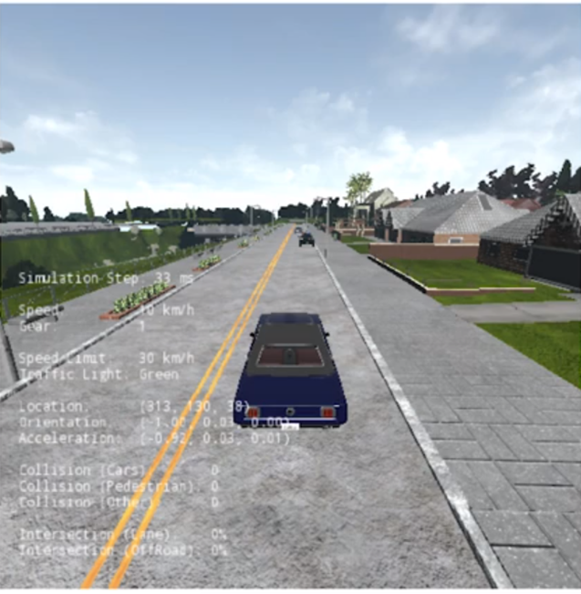

# Self-Driving Car Motion Planner

## Overview

This is a functional **`motion planning stack`** that can avoid both **static** and **dynamic** obstacles while tracking the **center line of a lane** as well as **handling road signs**. 

The system takes a set of `way-points` in a given road network until it reaches a goal.

The system performs the following tasks: 
- **Task 1:** Path generation: for road navigation 

 

- **Task 2:** Static obstacles avoidance

 

- **Task 3:** Dynamic obstacles avoidance

 

- **Task 4:** Road signs handling: Stop Sign

 

`Note`: This project is build on the top of the controller from [project 3](https://github.com/diesimo-ai/self-driving-car-projects/tree/main/p3-self-driving-vehicle-control). 


```python
class Controller2D(object):
    def __init__(self, waypoints):
      ...
```

## Carla Installation & Environment Setup

- [Modified Carla simulator](#) for this project which has some additional maps included.
  - Please refer to this [guide](https://github.com/diesimo-ai/self-driving-car-projects/tree/main/resources/customized-carla-simulator) document to download the installation setups

- After downloading the carla simulator you need to setup your working environment as follow

 

1. Navigate to the `PythonClient` folder located in the main `CarlaSimulator` directory.
2. Replace all the existing files in the `Course4FinalProject` folder with the files from your project repository (either #3 or #10).
3. Feel free to rename this folder to the name of the project you want to test, such as `p3_or_10_project_name` 

## Requirements

Strongly recommend to work on conda and create a new python environment and then install all your dependencies

- Make sure install the required dependencies for this current version of Carla Simulator first: 
 
```
- Pillow>=3.1.2
- numpy>=1.14.5
- protobuf>=3.6.0
- pygame>=1.9.4
- matplotlib>=2.2.2
- future>=0.16.0
- scipy>=0.17.0
```

- Then, the dependecies for the project are in the `requirements.txt` file of the current folder
  
To create a python 3.6 environment on conda

```sh
conda create --name py36 python=3.6
```

activate env

```sh
conda activate py36
```

install dependencies for client

```sh
conda install -r requirements.txt
```

## Usage

1. run Carla simulator first

If you're building on `windows` run: 

```batch
CarlaUE4.exe /Game/Maps/RaceTrack -windowed -carla-server -benchmark -fps=30
```
If you're on `linux` run: 

```bash
CarlaUE4.sh /Game/Maps/RaceTrack -windowed -carla-server -benchmark -fps=30
```

2. run python main module: 

```python 
python module_7.py
```

## Expected results

- Task1: Path generation 

@TODO 

- Task2 : Path collision checking and path selection (using circle based method)

@TODO

- Task3: Velocity profile generation

@TODO

- Task4: Behavioural planning - `State Machine Approach`

@TODO

## Contributing

Please create a pull request if you want to help this project grow. There are still great cool stuffs & ideas to add on, do not hesitate to add your own below.

`@TODO - list`

```
- Package the project into a PyPi library
- Create a C++ version of this project
- Add logger handler module for debugging
...
```

## References

- [Windows setup guide](https://github.com/afondiel/Self-Driving-Cars-Specialization/blob/main/Course1-Introduction-to-Self-Driving-Cars/resources/carla-simulator-install/CARLA-Setup-Guide-_Windows-x64_.pdf)
  - `TLDR:` [Personal notes](https://github.com/afondiel/Self-Driving-Cars-Specialization/blob/main/Course1-Introduction-to-Self-Driving-Cars/resources/carla-simulator-install/carla-simulator-install-on-windows.md)

- [Linux setup guide](https://github.com/afondiel/Self-Driving-Cars-Specialization/blob/main/Course1-Introduction-to-Self-Driving-Cars/resources/carla-simulator-install/CARLA-Setup-Guide-Ubuntu.pdf) 


