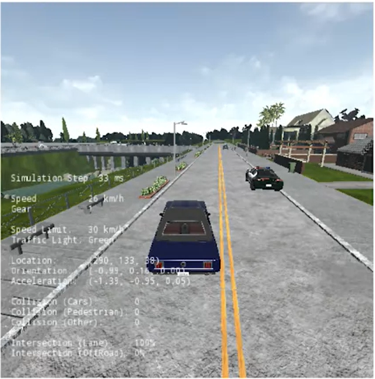
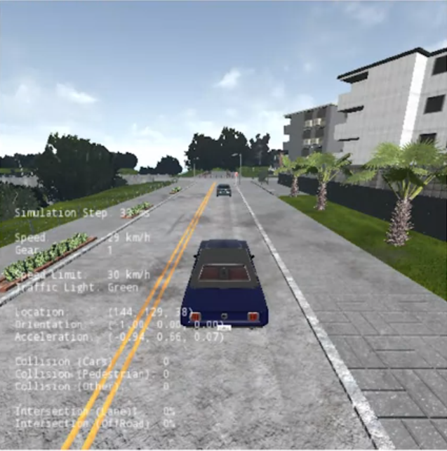
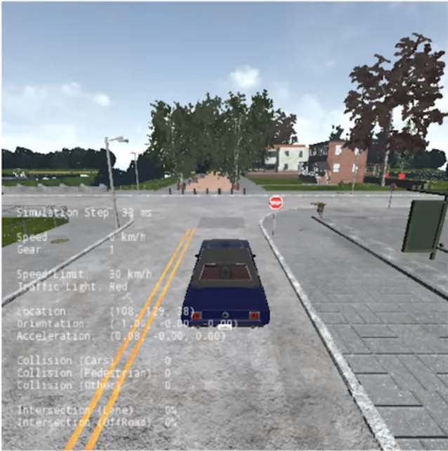
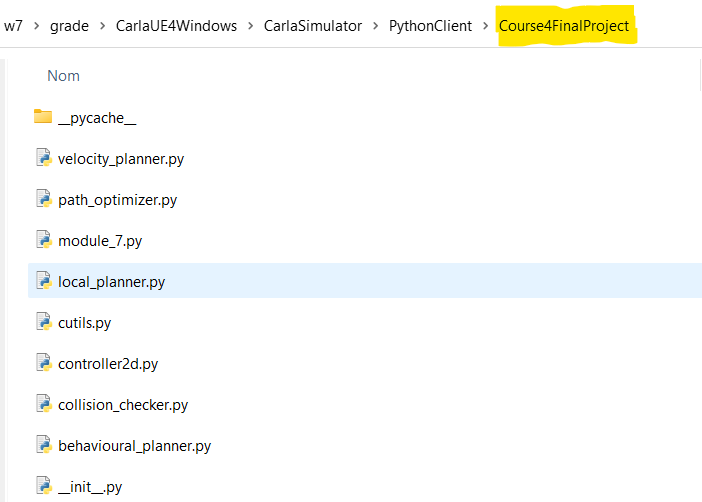
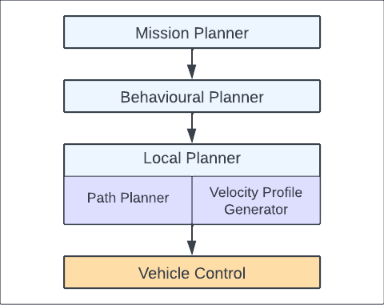
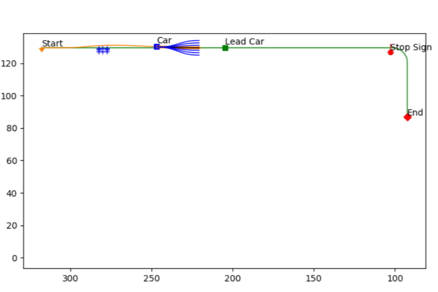
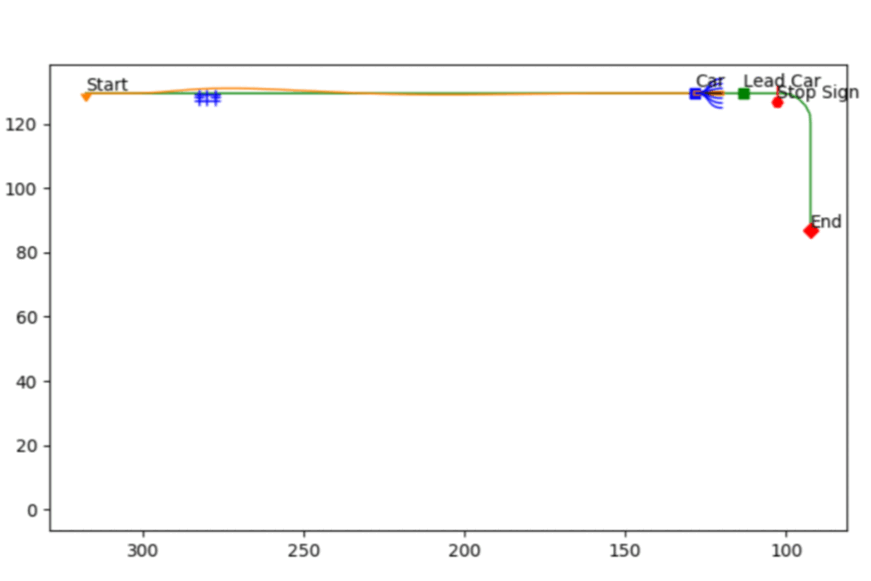
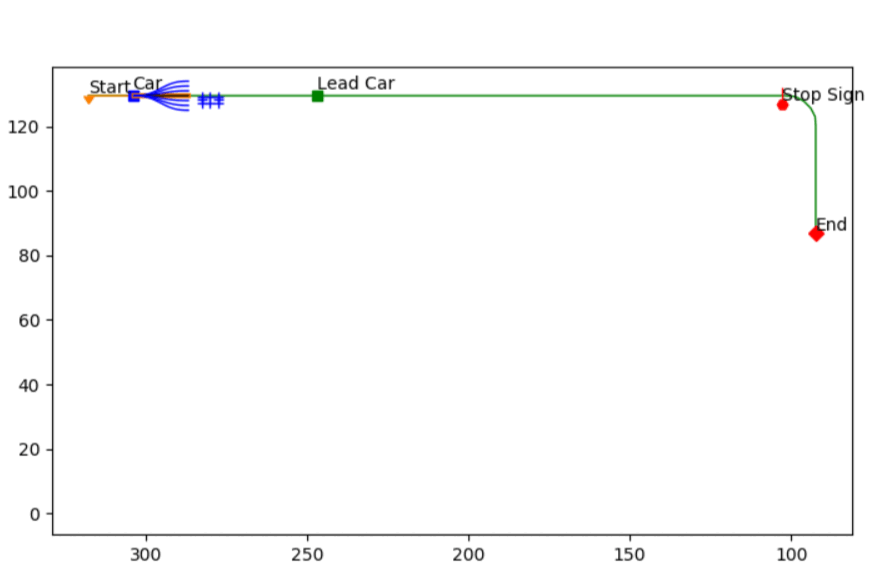

# Self-Driving Car Motion Planner

## Overview

This is a representative **`motion planning stack`** that avoids both **static** and **dynamic** obstacles while tracking the **center line of a lane**, and while also handling stop sign. 

The system takes a sequence of `way-points` in a given road network on Carla Simulator, and peforms the following tasks until it reaches a goal:

- **Task 1:** Static parked obstacle avoidance

 

- A parked obstacle will be blocking the driving path, and the car must avoid the collision.

- **Task 2:** Dynamic obstacle avoidance

 

- The car shall follow a lead vehicle moving below the speed limit, and the car shall adapt its velocity profile to accordingly to prevent a collision

- **Task 3:** Road sign handling - Stop Signs

 

`Note`: This project is build on the top of the controller from [project 3](https://github.com/diesimo-ai/self-driving-car-projects/tree/main/p3-self-driving-vehicle-control). 


```python
class Controller2D(object):
    def __init__(self, waypoints):
      ...
```

## Carla Installation & Environment Setup

- [Modified Carla simulator](#) for this project which has some additional maps included.
  - Please refer to this [guide](https://github.com/diesimo-ai/self-driving-car-projects/tree/main/resources/customized-carla-simulator) document to download the installation setups

- After downloading the carla simulator you need to setup your working environment as follow

 

1. Navigate to the `PythonClient` folder located in the main `CarlaSimulator` directory.
2. Replace all the existing files in the `Course4FinalProject` folder with the files from your project repository (either #3 or #10).
3. Feel free to rename this folder to the name of the project you want to test, such as `p3_or_10_project_name` 

## Requirements

Strongly recommend to work on conda and create a new python environment and then install all your dependencies

- Make sure install the required dependencies for this current version of Carla Simulator first: 
 
```
- Pillow>=3.1.2
- numpy>=1.14.5
- protobuf>=3.6.0
- pygame>=1.9.4
- matplotlib>=2.2.2
- future>=0.16.0
- scipy>=0.17.0
```

- Then, the dependecies for the project are in the `requirements.txt` file of the current folder
  
To create a python 3.6 environment on conda

```sh
conda create --name py36 python=3.6
```

activate env

```sh
conda activate py36
```

install dependencies for client

```sh
conda install -r requirements.txt
```
`Notes:` If you're having problems colleting some packages, try to search from a specific channel such as "--channel conda-forge" for example 


## Motion Planner Architecture

 

### Module Interfaces Descriptions

- **Mission Planner** 
  - Given maps on Carla Simulator
- **Behaviour Planner**
  - Finite State Machine (FSM) for handling Stop sign, and stop and go manouveurs+

```python
# State machine states
FOLLOW_LANE = 0
DECELERATE_TO_STOP = 1
STAY_STOPPED = 2
```

```python
class BehaviouralPlanner:
    def __init__(self, lookahead, stopsign_fences, lead_vehicle_lookahead):
        self._lookahead                     = lookahead
        self._stopsign_fences               = stopsign_fences
        self._follow_lead_vehicle_lookahead = lead_vehicle_lookahead
        self._state                         = FOLLOW_LANE
...
```
  
- **Local Planner**
  - Reactive planner (roll-out algorithm) takes a given path(start, goal), performs path opimization, collision-checking and generates `Path trajectory` and `Velocity Profile` for **control layer** 

  - Path optimizer : `Polynomial Spiral`
```python
class PathOptimizer:
	def __init__(self):
		"""!@private
			@param self this object
			@param self _xf, self._yf goal position 
			@param self._tf heading goal
		"""    
		self._xf = 0.0
        self._yf = 0.0
        self._tf = 0.0
```
  - Circle-based collision checking

```python
class CollisionChecker:
    def __init__(self, circle_offsets, circle_radii, weight):
        self._circle_offsets = circle_offsets
        self._circle_radii   = circle_radii
        self._weight         = weight
...
```
- Velocity Profile

```python
class VelocityPlanner:
    def __init__(self, time_gap, a_max, slow_speed, stop_line_buffer):
        self._time_gap         = time_gap
        self._a_max            = a_max
        self._slow_speed       = slow_speed
        self._stop_line_buffer = stop_line_buffer
        self._prev_trajectory  = [[0.0, 0.0, 0.0]]
```

```python
class LocalPlanner:
    def __init__(self, num_paths, path_offset, circle_offsets, circle_radii,
                 path_select_weight, time_gap, a_max, slow_speed,
                 stop_line_buffer, prev_best_path):
        self._num_paths = num_paths
        self._path_offset = path_offset
        self._path_optimizer = path_optimizer.PathOptimizer()
        self._collision_checker = \
            collision_checker.CollisionChecker(circle_offsets,
                                               circle_radii,
                                               path_select_weight)
        self._velocity_planner = \
            velocity_planner.VelocityPlanner(time_gap, a_max, slow_speed,
                                             stop_line_buffer)
        self.prev_best_path = []
```

- **Vehicle Control**
  - Bicycle model
  - Longitudinal control : PID 
  - Geometric Lateral Control : Stanley

```python
class Controller2D(object):
    def __init__(self, waypoints):
		self.vars           = cutils.CUtils()
		self._waypoints     = waypoints
...
```
`Notes`: The waypoints are the reference signals, which include the `position` and the `speed` the vehicle should attain.

## Usage

1. run Carla simulator first

If you're building on `windows` run: 

```batch
CarlaUE4.exe /Game/Maps/RaceTrack -windowed -carla-server -benchmark -fps=30
```
If you're on `linux` run: 

```bash
CarlaUE4.sh /Game/Maps/RaceTrack -windowed -carla-server -benchmark -fps=30
```

2. run python main module: 

```python 
python module_7.py
```

## Expected results

**Task 1:** Static parked obstacle avoidance

 

- Selects a path index which is closest to the center line as well as far away from collision paths.

**Task 2:** Dynamic obstacle avoidance

 

Analysis Notes: @TODO

**Task 3:** Road sign handling - Stop Sign

 

- Stop and go manouveur - here we can see three of vehicle when approaching the stop signs: before, stopped, after

**Putting It All Together From: Start to Finish**

 

Analysis Notes: @TODO 

## Contributing

Please create a pull request if you want to help this project grow. There are still great stuffs & ideas to add on, or an issue if you encounter any problem.

`@TODO - list`

```
- Package the project into a PyPi library
- Add logger handler module for debugging
- Create a C++ version of this project
- Add more road signs and adapt the behaviour planner accordingly 
- ...
```

## References

- [Carla Simulator - Windows setup guide](https://github.com/afondiel/Self-Driving-Cars-Specialization/blob/main/Course1-Introduction-to-Self-Driving-Cars/resources/carla-simulator-install/CARLA-Setup-Guide-_Windows-x64_.pdf)
  - [TLDR - Personal notes](https://github.com/afondiel/Self-Driving-Cars-Specialization/blob/main/Course1-Introduction-to-Self-Driving-Cars/resources/carla-simulator-install/carla-simulator-install-on-windows.md)

- [Carla Simulator - Linux setup guide](https://github.com/afondiel/Self-Driving-Cars-Specialization/blob/main/Course1-Introduction-to-Self-Driving-Cars/resources/carla-simulator-install/CARLA-Setup-Guide-Ubuntu.pdf) 


