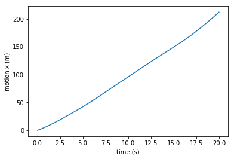

# Longitudinal Vehicle Model

## Overview

This is a basic longitudinal vehicle model, based on the dynamic of the vehicle that generates `forward motion.`

The model controls the `throttle` profile given as inputs and the inclination `angle` of the road ($\alpha$) and steps through the longitudinal dynamic equations and return the `dynamic states` of the vehicle.


```python
class Vehicle(Vehicle):
    def step(self, throttle, alpha):
        ...
        return l_dyn_states
```

Note: The dynamic output states of the model can be modified based on the needs of the problem to be solved. 

## Dependency Requirements

- Any notebooks tool such as : [Jupyter notebook](https://jupyter.org/) or [Google Colab](https://colab.research.google.com/?utm_source=scs-index#scrollTo=5fCEDCU_qrC0) to run the notebook.


## Usage

Open the notebook file and simply run each cell sequentially to see the results.

## Expected Results

Model input profiles:  

- Road slope - based on the `alpha value`


- `Throttle profile (%)` : to climb the given slope in 20 secs


Model Output:

`Motion :`




## Contributing

Please create a pull request if you want to take this project to a new next level. There are still great cool stuffs & ideas to add on, do not hesitate to add your own below.

`@TODO - list`

```
- Convert notebook into a python project
- Package the project into a PyPi package
- Create a C++ version of the model
...
```

## References

- [Vehicle Dynamic Modeling (VDM) - course from Self-Driving specialization from UoF](https://github.com/afondiel/Self-Driving-Cars-Specialization/blob/main/Course1-Introduction-to-Self-Driving-Cars/course1-w4-notes.md)


- [Great book on Vehicle Dynamics and Control - By Rajamani R.(2012) - Check Chapter 4](https://link.springer.com/chapter/10.1007/978-1-4614-1433-9_4)

