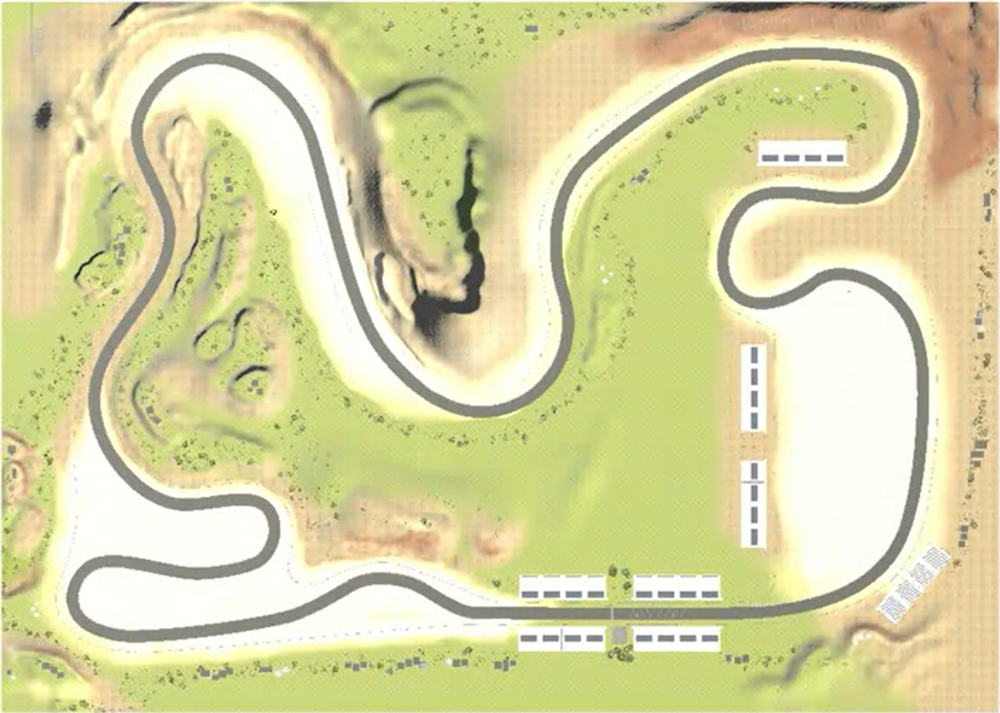
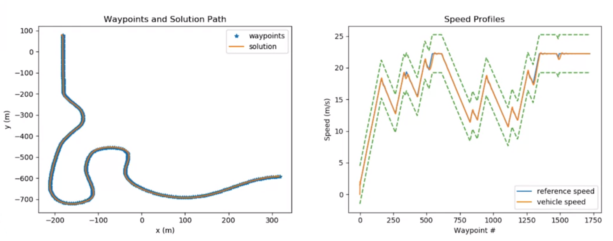

# Self-Driving Vehicle Control

## Overview

This is a simple self-driving controller aimed to drive a car around a track in Carla simulator.

 

The controller gets a sorted list of waypoints which are equally spaced on this track and navigates to all the waypoints effectively completes the full track 

```python
class Controller2D(object):
    def __init__(self, waypoints):
      ...
```

The waypoints include their `positions` as well as `the speed` the vehicles should attain.

Controller Output:

 

The controller sends the throttle and brake commands from the longitudinal control and steering angle commands from your lateral control. 


## Dependency Requirements

- python=3.6
- [Carla Simulator](https://github.com/carla-simulator/carla)


## Installation & Setup

- [Windows setup guide](https://github.com/afondiel/Self-Driving-Cars-Specialization/blob/main/Course1-Introduction-to-Self-Driving-Cars/resources/carla-simulator-install/CARLA-Setup-Guide-_Windows-x64_.pdf)
  - `TLDR:` [Personal notes](https://github.com/afondiel/Self-Driving-Cars-Specialization/blob/main/Course1-Introduction-to-Self-Driving-Cars/resources/carla-simulator-install/carla-simulator-install-on-windows.md)

- [Linux setup guide](https://github.com/afondiel/Self-Driving-Cars-Specialization/blob/main/Course1-Introduction-to-Self-Driving-Cars/resources/carla-simulator-install/CARLA-Setup-Guide-Ubuntu.pdf) 


## Usage

1. run Carla simulator first

If you're building on `windows` run: 

```batch
CarlaUE4.exe /Game/Maps/RaceTrack -windowed -carla-server -benchmark -fps=30
```
If you're on `linux` run: 

```bash
CarlaUE4.sh /Game/Maps/RaceTrack -windowed -carla-server -benchmark -fps=30
```

2. run python main module: 

```python 
python module_7.py
```

## Contributing

Please create a pull request if you want to take this project to a new next level. There are still great cool stuffs & ideas to add on, do not hesitate to add your own below.

`@TODO - list`

```
- Convert notebook into a python project
- Package the project into a PyPi package
- Create a C++ version of the model
...
```


