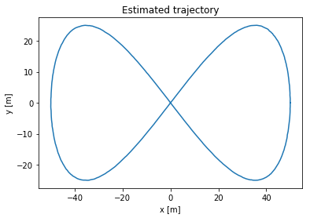
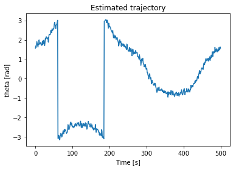

# Self-Driving Car Trajectory Estimation


## Overview

This is an implementation of Extended Kalman filter (EKF), which will estimate the position of a vehicle along a given [trajectory](./data/) of a vehicle using odometry, range and bearing measurements.


The system uses two models : 
1. Measurement model (sensor based) 
2. Motion model 

The vehicle is equipped with a very simple type of LIDAR sensor, which returns range and bearing measurements corresponding to individual landmarks in the environment. 

The global positions of the landmarks are assumed to be known beforehand. We will also assume known data association, that is, which measurement belong to which landmark.

**Ground truth**

 

**Output Estimate**

Trajectory : 

 

Vehicle Orientation : 

 


## Dependency Requirements

You need a notebook tool whether it is a [Google colab](https://colab.research.google.com/?hl=en), [Jupyter notebook](https://jupyter.org/) or [JupyterLab](https://jupyter.org/), or any other one.

## Usage

Run the notebook cell by cell to get to see the results.


## Contributing

Please create a pull request if you want to take this project to a new next level. There are still great cool stuffs & ideas to add on, do not hesitate to add your own below.

`@TODO - list`

```
- Convert notebook into a python project
- Package the project into a PyPi package
- Create a C++ version of the model
...
```


