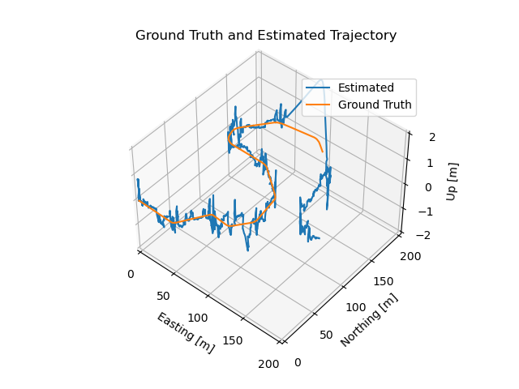

# Self-Driving Vehicle State Estimation on Roadway

## Overview

This is a Self-Driving Vehicle State Estimation on Roadway implementation using an Error-State Extended Kalman Filter (ES-EKF) to localize a vehicle using data from the [CARLA simulator](https://carla.org/).

### State Estimation Pipeline 

 

The dataset was gathered during a test drive in the CARLA simulator and contains measurements from sensors : 
- `IMU` measurements are used to drive the motion model forward in time at a high update rate 
- `GNSS` receiver or the `LIDAR` are used for position measurements 
  
We incorporate the measurement by performing the Kalman filter update step :  
- The motion model produces the `predicted state` estimate.
- The prediction correction loop is performed as long as the vehicle is driving, the result is the `corrected state` estimate. 


### Estimator Tasks

The Estimator operates in 3 phases : 

- **Taks 1**: perform the filter prediction step and the correction step  
- **Task 2**: handles the effects of sensor miscalibration on the vehicle pose estimates. A filter parameters (noise variances) adjustment is needed in this phase to attempt to compensate for these errors
- **Task 3**: examine how the loss of external corrections results in drift in the vehicle position estimate, and how the uncertainty in the position estimate changes when sensor measurements are unavailable.


## Requirements

```sh
pip install -r requirements.txt
```
or if you're conda

```sh
conda install -r requirements.txt
```

## Usage

### Data loading 

- Task 1 & 2

```python 
with open('data/pt1_data.pkl', 'rb') as file:
    data = pickle.load(file)
```

- Task 3

```python 
with open('data/pt3_data.pkl', 'rb') as file:
    data = pickle.load(file)
```


To run the project simply perform 

```python 
python es_ekf.py
``` 

### Estimator output

**Ground truth**

 

**Output Estimate**


 


## Contributing

Please create a pull request if you want to take this project to a new next level. There are still great cool stuffs & ideas to add on, do not hesitate to add your own below.

`@TODO - list`

```
- Add a sensor fusion module
- Package the project into a PyPi package
- Create a C++ version of the model
...
```


