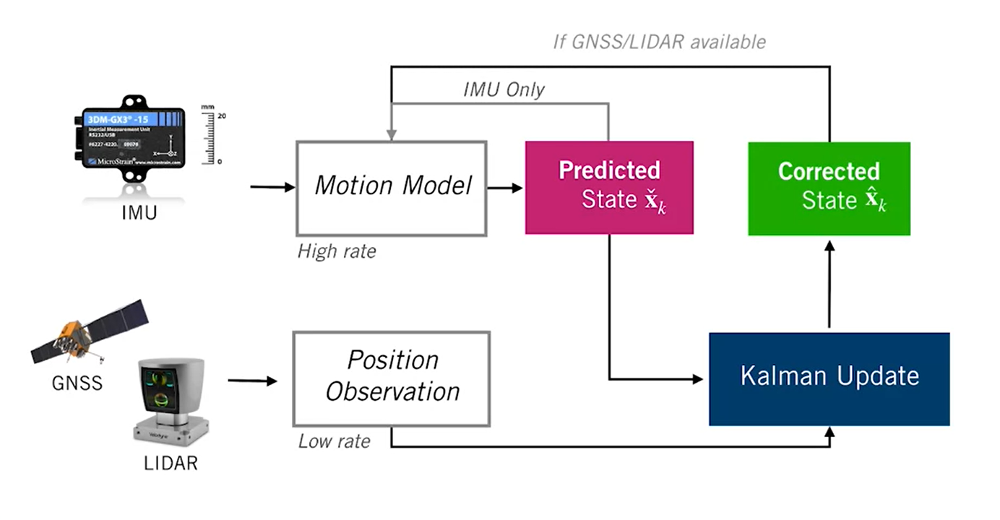
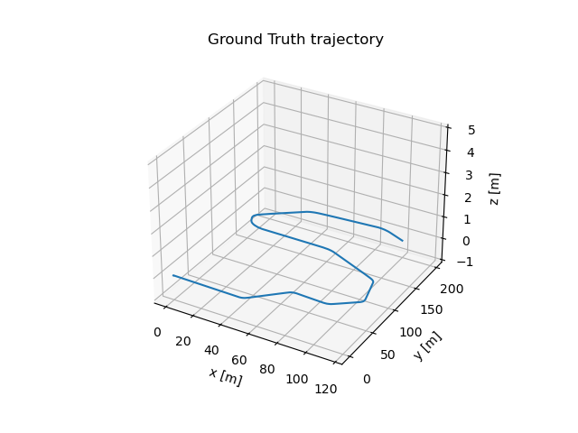
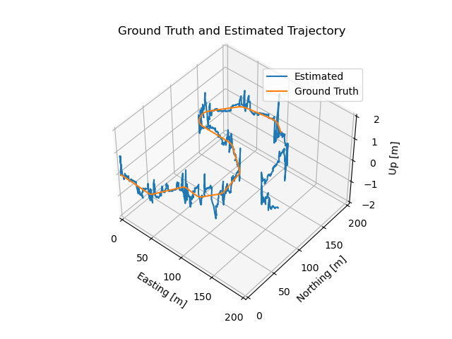
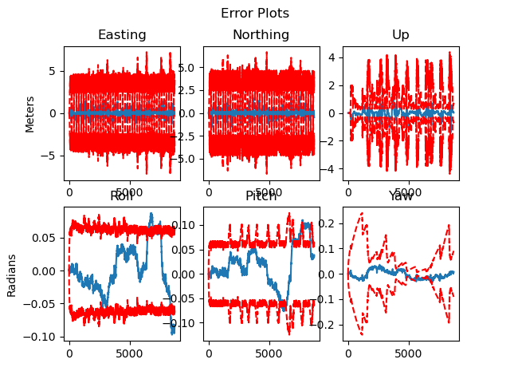

# Self-Driving Vehicle State Estimation on Roadway

## Overview

This is a filter-based state estimator for self-driving vehicles, designed to determine the vehicle's position on roadway, within an existing map in the [CARLA simulator](https://carla.org/).

The system uses Error-State Extended Kalman Filter(ES-EKF) to `fuse` GPS, IMU, and LIDAR data from [CARLA simulator](https://carla.org/) to create a high-update-rate estimator to determining vehicle position and orientation while exploring sensor failure effects.
### Estimator Architecture

 

The providen dataset was gathered during a test drive in the CARLA simulator and contains measurements from sensors: 
- `IMU` measurements are used to drive `the motion model forward in time at a high update rate 
- `GNSS` receiver or the `LIDAR` are used for position measurements 
  
The Kalman filter update step :  
- The motion model produces the `predicted state` estimate.
- The prediction correction loop is performed as long as the vehicle is driving, the result is the `corrected state` estimate. 

### Estimator Tasks

The Estimator operates in 3 phases : 

- **Taks 1 - prediction and correct**: perform the filter prediction and the correction step  

The following block of code determines the rotation between the LIDAR sensor frame and the IMU frame

```python
# This is the correct calibration rotation matrix, corresponding to an euler rotation of 0.05, 0.05, .1.
C_li = np.array([
    [ 0.99376, -0.09722,  0.05466],
    [ 0.09971,  0.99401, -0.04475],
    [-0.04998,  0.04992,  0.9975 ]
])
```

- **Task 2 - sensor miscalibration**: handles the effects of sensor miscalibration on the vehicle pose estimates. A filter parameters (noise variances) adjustment is needed in this phase to attempt to compensate for these errors

The following chunk of code is a sensor miscalibration to perform task 2

```python
# This is an incorrect calibration rotation matrix, corresponding to a rotation of 0.05, 0.05, 0.05
C_li = np.array([
    [ 0.9975 , -0.04742,  0.05235],
    [ 0.04992,  0.99763, -0.04742],
    [-0.04998,  0.04992,  0.9975 ]
])
```

- **Task 3 - sensor dropout**: examine how the loss of external corrections results in drift in the vehicle position estimate, and how the uncertainty in the position estimate changes when sensor measurements are unavailable.


## Requirements

```sh
pip install -r requirements.txt
```
or if you're using conda

```sh
conda install -r requirements.txt
```

## Usage

### Data loading 

- Task 1 & 2

```python 
with open('data/pt1_data.pkl', 'rb') as file:
    data = pickle.load(file)
```

- Task 3

```python 
with open('data/pt3_data.pkl', 'rb') as file:
    data = pickle.load(file)
```

To run the project simply perform 

```python 
python es_ekf.py
``` 

### Estimator output

**Ground truth**

 

**Output Estimate**

 

Output for task 1, for the output of task 2 & 3 refer to [graph](./graph/) repo.

**Error estimates**

 

- The error for each of the 6 [DOF](https://en.wikipedia.org/wiki/Degrees_of_freedom_(statistics)), and estimates for the uncertainty 
- The error estimates are in blue, and the uncertainty bounds are red and dashed.
- The uncertainty bounds are $\displaystyle \pm 3 \sigma$ (standard deviations) based on the uncertainty (covariance). 

This estimator can be improved by performing some tuning on the measurements with the known ground truth and adjusting the measurement and process noise of the filter. 

## Contributing

What to help this project grow? 

- Please create a pull request if you have any great idea to share, or an issue if you encoutered any problem while running the project.


`@TODO - list`

```
- Package the project into a PyPi package
- Create a C++ version of the model
- add logger module for logging and debugging
...
```

