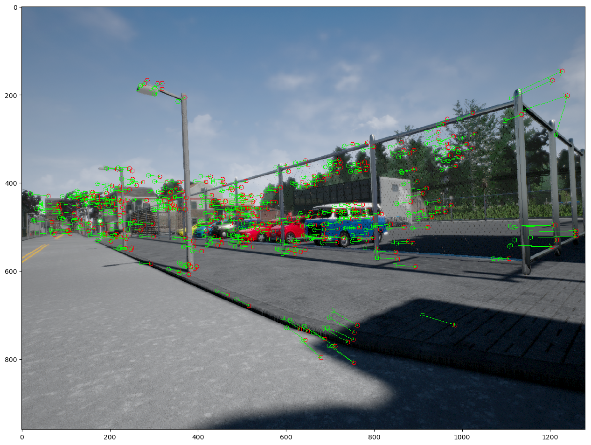
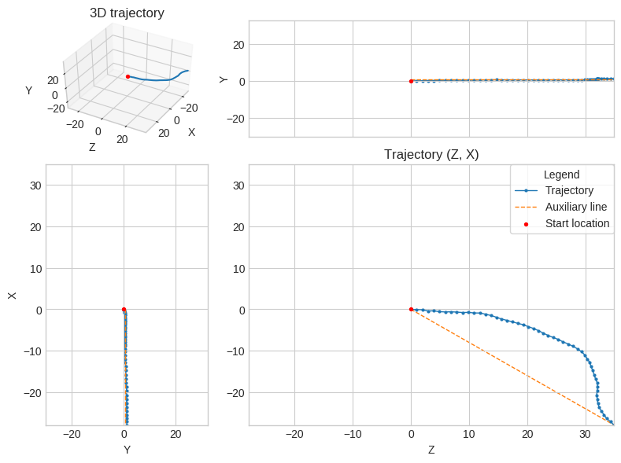

# Visual Odometry for Localization

## Overview

This a Visual Features, which estimates an autonomous `vehicle trajectory` from images taken with a monocular camera set up on the vehicle.

 

The system perfom the following tasks : 
- Extract features from the photographs taken with a camera setup on the vehicle.
- Use the extracted features to find matches between the features in different photographs.
- Use the found matches to estimate the camera motion between subsequent photographs.
- Use the estimated camera motion to build the vehicle trajectory (based on image pair in the dataset)

### Dataset : images, images_rbg, depth_maps ... 

The data samples were taken from Carla Simulator.

- **Data location** :
  - [data](self-driving-car-projects\p6-visual-odometry-for-localization\data) folder (600MB)
    - `depth` - 52 data frames
    - `rgb` - 52 data frames

You need to create a dataset handler object to access the datas. The dataset handler class to read and iterate through samples

```python
dataset_handler = DatasetHandler()
```
- **Dataset handler Attributes**

The frame content can be accessed by using `images`, `images_rgb`, `depth_maps` attributes of the dataset handler object along with the index of the requested frame.

```
- dataset_handler.images : grayscales samples
- dataset_handler.images_rgb : 3-channels imgs
- dataset_handler.depth_maps : depth maps
- dataset_handler.num_frame : Number of frames
- dataset_handler.k : Calibration matrix K
```
To access a single image sample

```python
image = dataset_handler.images[0]
```

## Requirements

```sh
pip install -r requirements.txt
```
or if you're on conda

```sh
conda install -r requirements.txt
```

## Usage

You'll need a notebook tool such as a [Google Colab](https://colab.research.google.com/?utm_source=scs-index#scrollTo=5fCEDCU_qrC0) or [Jupyter notebook](https://jupyter.org/) 

Then simply run the notebook each cell sequentially to see the results.

## Results

 

## Contributing

Please create a pull request if you want to take this project to a new next level. There are still great cool stuffs & ideas to add on, do not hesitate to add your own below.

`@TODO - list`

```
- Convert notebook into a python project
- Package the project into a PyPi package
- Create a C++ version of the model
...
```


