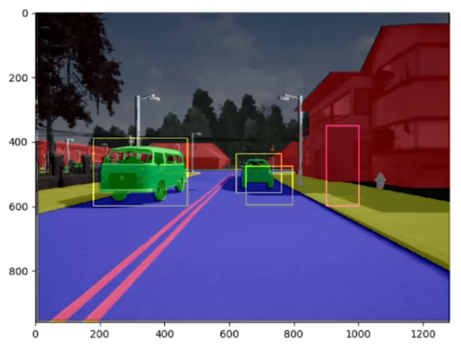
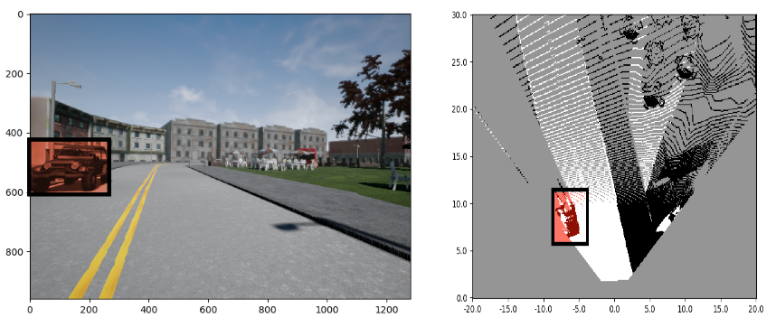
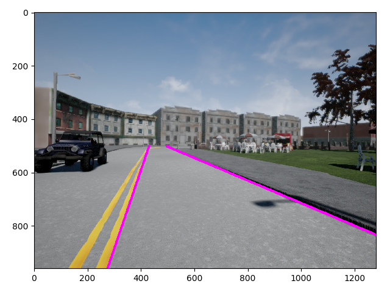
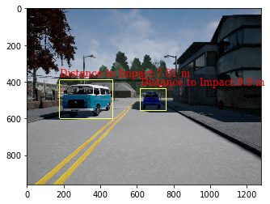

# Self-Driving Car Environment Perception

## Overview

This is a `baseline perception stack` for Self-Driving Vehicles,which extract useful scene information from the environment to drive safely and reliably by perfoming complex tasks.

 

The system uses the output of `semantic segmentation neural networks  model` to perform the following tasks: 
  
- **Task 1**: Drivable space estimation in 3D
- **Task 2**: Lane estimation
- **Task 3**: Filter errors in the output of 2D object detectors
- **Task 4**: Use the filtered 2D object detection results to determine how far `obstacles` are from the self-driving car

The all tasks are well documented thourough the notebook.

### Dataset : images, images_rbg, depth_maps ... 

The data samples provided were collected from Carla Simulator.

- **Data Description** :
  - [data](self-driving-car-projects\p6-visual-odometry-for-localization\data) folder containts 3 test data frame in a total of 47MB size
    - `depth` - depth images
    - `rgb` - RGB images
    - `segmentation` - the output of a semantic segmentation neural network

You need to create a dataset handler object  to access the datas. The dataset handler class is defined in the [m6bk module](m6bk.py), and allow to read and iterate through samples

```python
dataset_handler = DatasetHandler()
```
- **Dataset handler Attributes**

The frame content can be accessed by using `images`, `images_rgb`, `depth_maps` attributes of the dataset handler object along with the index of the requested frame.

```
- dataset_handler.image: grayscales samples
- dataset_handler.depth: depth maps
- dataset_handler.segmentation: output semantic segmentation Neural Nets
- dataset_handler.object_detection: output 2D obj detection Neural Nets
- dataset_handler.k : Calibration matrix K
...
```
To access a single image frame and visualize it.

```python
image = dataset_handler.image
plt.imshow(image)
```

## Requirements

```sh
pip install -r requirements.txt
```
or if you're on conda

```sh
conda install -r requirements.txt
```

## Usage

You'll need a notebook tool such as a [Google Colab](https://colab.research.google.com/?utm_source=scs-index#scrollTo=5fCEDCU_qrC0) or [Jupyter notebook](https://jupyter.org/), then simply run the notebook each cell sequentially to see the results.

## Expected results

- **Task 1 - Drivable space estimation in 3D** : is determined based on ground plane 3D model and comparing each pixel belonging in the ground plane to a distance threshold. This is shown in occupancy grid on the right image below.

 

- **Task 2 - Lanes estimation** : allow to estimate where the car is allow to drive

 

- **Task 3 & 4 - Minimum Distance To impact Estimation** : after filtering the errors from the 2D object detectors we can determine the distance to impact to other objects, as well as their location in the scene

 


## Contributing

Please create a pull request if you want to take this project to a new next level. There are still great cool stuffs & ideas to add on, do not hesitate to add your own below.

`@TODO - list`

```
- Convert notebook into a python project
- Package the new project into a PyPi package
- Create a C++ version of the model
- Develop API/interfaces to run the entire project into NVIDIA Jetson Computer or any other AI-supported edge computer 
...
```


