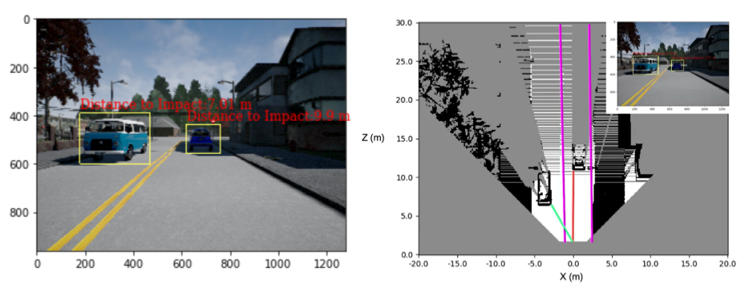

# Self-Driving Car Environment Perception

## Overview

This is a `baseline perception stack` for Self-Driving Vehicles, which extracts useful information from its surroudings and perform complex tasks in order to drive safely through the world.

 

The system uses the output of a `semantic segmentation neural networks model` like [SegNet](https://arxiv.org/abs/1511.00561), as input, to perform the following tasks: 
  
- **Task 1**: Drivable space estimation in 3D
- **Task 2**: Lane estimation
- **Task 3**: Filter errors in the output of 2D object detectors
- **Task 4**: Use the filtered 2D object detection results to determine how far `obstacles` are from the self-driving car

All tasks are well documented in the notebook.

### Dataset Description: images, images_rbg, depth_maps ... 

The data samples provided were collected from Carla Simulator.

- [data](self-driving-car-projects\p6-visual-odometry-for-localization\data) folder has 3 test data frame, a total of 47 MB
  - `depth` - depth images
  - `rgb` - RGB images
  - `segmentation` - the output of a semantic segmentation neural network ([SegNet](https://arxiv.org/abs/1511.00561))

We use the `DatasetHandler()` class defined in the [m6bk module](./m6bk.py), to access and extract datas from the dataset.

```python
dataset_handler = DatasetHandler()
```
We then use the `dataset_handler` to access the specific frame we want.

For example, to access a single image frame and visualize it.

```python
image = dataset_handler.image
plt.imshow(image)
```

Other attributes:

```
- dataset_handler.image: image
- dataset_handler.depth: depth maps
- dataset_handler.segmentation: output from semantic segmentation NeuralNets
- dataset_handler.object_detection: output 2D obj detection NeuralNets
- dataset_handler.k : Calibration matrix K
...
```
## Requirements

```sh
pip install -r requirements.txt
```
or if you're on [conda](https://github.com/conda) or [miniconda](https://docs.conda.io/en/latest/miniconda.html)

```sh
conda install --file requirements.txt
```
`Notes:` If you're having problems colleting some packages, try to search from a specific channel by adding "--channel" flag. For example "--channel conda-forge" 

## Usage

Open the notebook with [Jupyter notebook](https://jupyter.org/) or [Google Colab](https://colab.research.google.com/?utm_source=scs-index#scrollTo=5fCEDCU_qrC0) run the cells sequentially to see the results.

## Expected results

- **Task 1 - Drivable space estimation in 3D** : is determined based on ground plane 3D model and comparing each pixel belonging in the ground plane to a distance threshold. This is shown in occupancy grid on the right image below.

 

- **Task 2 - Lanes estimation** : allow to estimate where the car is allow to drive

 

- **Task 3 & 4 - Minimum Distance To impact Estimation** : after filtering the errors from the 2D object detectors we can determine the distance to impact to other objects, as well as their location in the scene

 

Result summary

 


## Contributing

Please create a pull request if you want to help this project grow, there are still many stuffs to be added on. Also, do not hesitate to open an issue if you encounter any problem

`@TODO - list`

```
- Convert notebook into a python project
- Package the new project into a PyPi package
- Create a C++ version of the model
- Develop API/interfaces to run the entire project into NVIDIA Jetson Computer or any other AI-supported edge computer 
...
```


