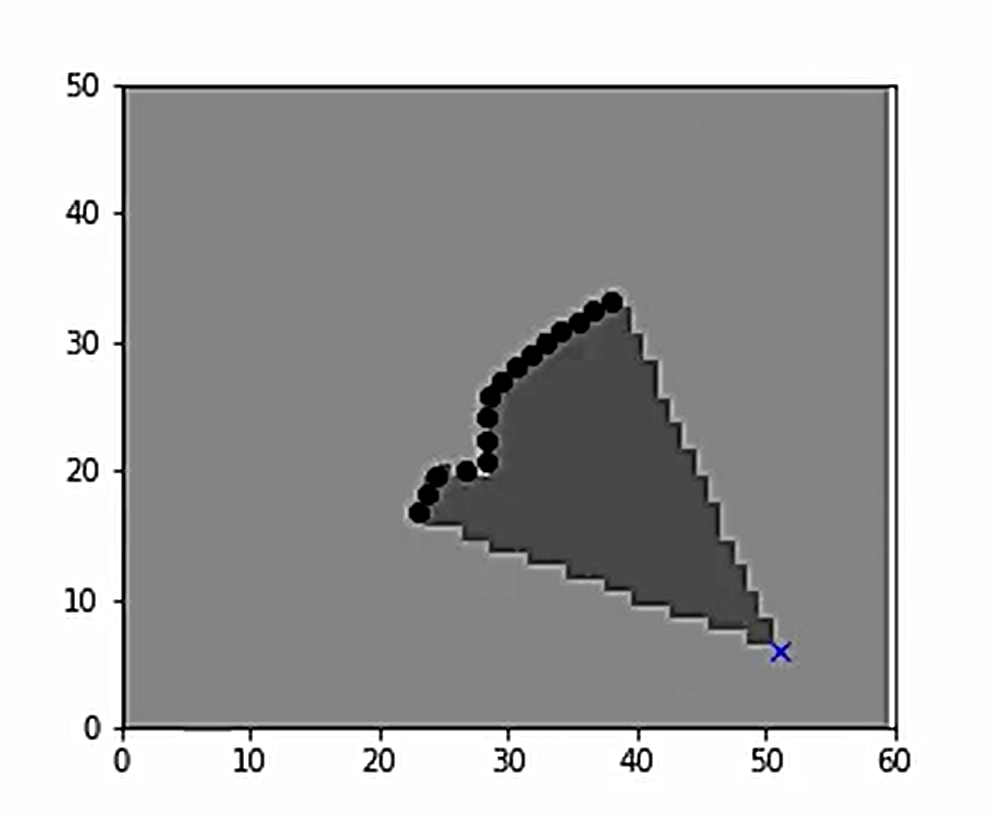
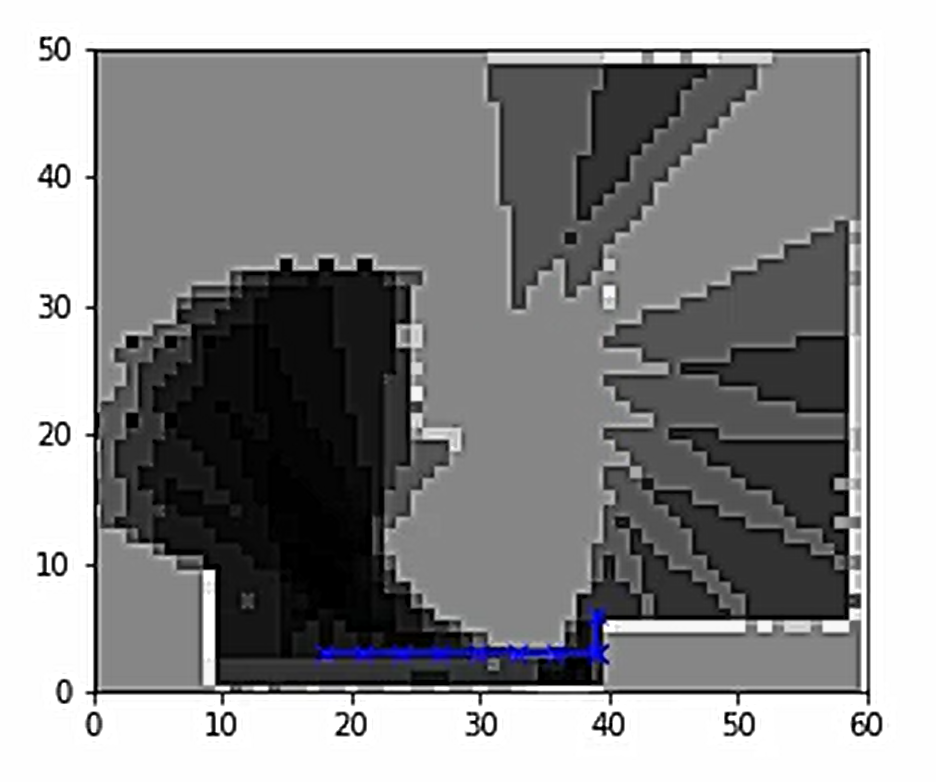
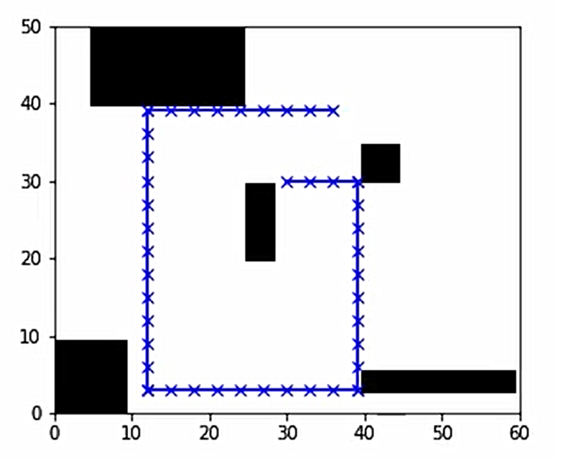

# Occupancy Grid Map Generator

## Overview

This is an Occupancy Grid Map Generator using lidar scanner measurements from a moving vehicle in an unknown environment. 

The system uses the `inverse scanner measurement model` to map these measurements into occupancy probabilities 

```python
def inverse_scanner(
                    num_rows, 
                    num_cols, 
                    x, y, theta, 
                    meas_phi, 
                    meas_r, 
                    rmax, 
                    alpha, 
                    bet):
    pass

    # returns a matrix of measured occupancy probability values based on the lidar scan model
    return m    
```

We also need to get the scanned ranges value for a given vehicle position and scanner bearing by using the `the ray tracing algorithm`

```python
def get_ranges(true_map, X, meas_phi, rmax):
    pass
    return meas_r
```

**Simulation loop :**, which simulates the vehicle motion and  and then performs iterative `log-odds updates` to an occupancy grid belief map.

```python
# Main simulation loop.
for t in range(1, len(time_steps)):
    # Perform robot motion.
    move = np.add(x[0:2, t-1], u[:, u_i]) 
    # If we hit the map boundaries, or a collision would occur, remain still.
    if (move[0] >= M - 1) or (move[1] >= N - 1) or (move[0] <= 0) or (move[1] <= 0) \
        or true_map[int(round(move[0])), int(round(move[1]))] == 1:
        x[:, t] = x[:, t-1]
        u_i = (u_i + 1) % 4
    else:
        x[0:2, t] = move
    x[2, t] = (x[2, t-1] + w[t]) % (2 * math.pi)
    
    # Gather the measurement range data, which we will convert to occupancy probabilities
    # using our inverse measurement model.
    meas_r = get_ranges(true_map, x[:, t], meas_phi, rmax)
    meas_rs.append(meas_r)
    
    # Given our range measurements and our robot location, apply our inverse scanner model
    # to get our measure probabilities of occupancy.
    invmod = inverse_scanner(M, N, x[0, t], x[1, t], x[2, t], meas_phi, meas_r, rmax, alpha, beta)
    invmods.append(invmod)
    
    # Calculate and update the log odds of our occupancy grid, given our measured
    # occupancy probabilities from the inverse model.
    L = np.log(np.divide(invmod, np.subtract(1, invmod))) + L - L0
    
    # Calculate a grid of probabilities from the log odds.
    m = (np.exp(L)) / (1 + np.exp(L))
    ms.append(m)
```

## Requirements

- Any notebooks tool such as : [Jupyter notebook](https://jupyter.org/) or [Google Colab](https://colab.research.google.com/?utm_source=scs-index#scrollTo=5fCEDCU_qrC0) to run the notebook.


## Usage

Open the notebook file and simply run each cell sequentially to see the results.

## Expected Results

The final output is a simulation animation of a robot motion in the : 

- Inverse model or mesured belief map

 

- Occupancy grid belief map

 

- Final True map  

 

## Contributing

Please create a pull request if you want to take this project to a new next level. There are still great cool stuffs & ideas to add on, do not hesitate to add your own below.

`@TODO - list`

```
- Convert notebook into a full python project
- Package the project into a PyPi package
- Create a C++ version of the model
...
```


## References

- [Self-Driving-Cars-Specialization Course-4 - W2 - MODULE 2: Mapping for Planning - Lesson 1](https://github.com/afondiel/Self-Driving-Cars-Specialization/blob/main/Course4-Motion-Planning-for-Self-Driving-Cars/course4-w2-notes.md#lab--occupancy-grid-generation)
- [Occupancy Grids on MATLAB - by MathWorks](https://www.mathworks.com/help/robotics/ug/occupancy-grids.html)
- [Occupancy grid mapping - wikipedia](https://en.wikipedia.org/wiki/Occupancy_grid_mapping)
- 
