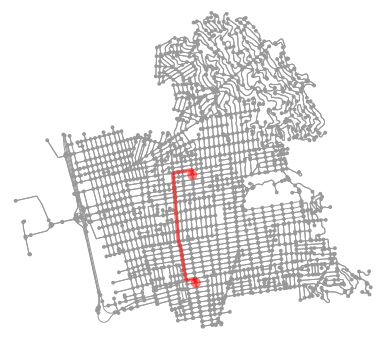

# Pathfinding Algorithms

## Overview


This is the implementations of two search algorithms in mission planning used to navigate the self-driving vehicle from a start location(node) to a destionation location(node) a road network in Berkeley, California: 
- The Dijkstra's search algorithm
- The A* (A-star) search algorithm

We first implement the Dijkstra's search algorithm, then we modify it using a distance heuristic to perform A* search. 

In the end we compare the performance of both algorithms to a mapping library's path

## Requirements

```cmd
- osmnx
- networkx
- queue
- math
```

## Map Data 

The graphs are generated from [Open Street Map (OSM)](https://www.openstreetmap.org/#map=6/46.449/2.210) using [OSMNX python library](https://osmnx.readthedocs.io/en/stable/) and represented using [NetworkX python library](https://networkx.github.io/documentation/stable/)

```python
map_graph = ox.graph_from_place('Berkeley, California', network_type='drive')
```
## Usage

Dijkstras Search interface:

```python
def dijkstras_search(origin_key, goal_key, graph):
    pass

    return get_path(origin_key, goal_key, predecessors)
```


A-star Search interface:

```python
def a_star_search(origin_key, goal_key, graph):
    pass
    
    return get_path(origin_key, goal_key, predecessors)  
```

Open and run the notebook to see the results


## Expected Results

Output from starting to the destination location using both Dijkstra's and A* search algorithm

 

## Contributing

Please create a pull request if you want to take this project to a new next level. There are still great cool stuffs & ideas to add on, do not hesitate to add your own below.

`@TODO - list`

```
- Convert notebook into a full python project
- Package the project into a PyPi package
- Create a C++ version of the model
...
```


## References

For father reading : 
- [Self-Driving-Cars-Specialization Course-4 - W3 - MODULE 3: Mission Planning in Driving Environments](https://github.com/afondiel/Self-Driving-Cars-Specialization/blob/main/Course4-Motion-Planning-for-Self-Driving-Cars/course4-w3-notes.md)

